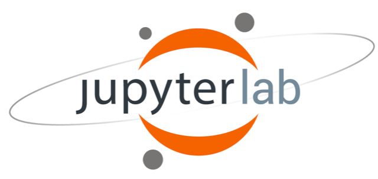

# Parallel Programming in Python: Multithreading and Multiprocessing

Material for threading and multiprocessing in python 

## Objectives
Learning Outcomes for attendees of this workshop:

* Able to understand the differences between multithreading and multiprocessing.
* Know which tasks are better suited for multithreading or multiprocessing
* Able to use threading and multiprocessing packages for appropriately suited tasks.

## Outline
* Overview:
  * [Jupyter Lab IDE & Notebook Basics](notebooks/jupyter_intro.ipynb)
  * [Overview of parallel computing with python](notebooks/overview.ipynb)
* [Threading:](notebooks/threading.ipynb)
  * c-extension thread enabled libraries (numpy & scipy)
  * threading package
* [Multiprocessing:](notebooks/multiproc.ipynb)
  * Process class
  * Pool class
* Other parallel libraries:
  * [pymp -- OpenMP-like functionality for Python](notebooks/pymp.ipynb)

## Running the Notebooks using the Jupyter Lab launch script for midway


We will use the research computing center compute resources to run a jupyter lab IDE through
your web browser. In order to access the jupyterlab interactive environment to view and execute the jupyter notebooks,
you will need to run the launch-jlab.sh script that can be found with this repository.

This repo contains a bash script (`launch-jlab.sh`) that when executed will start
a jupyter lab session on a midway compute node and present options for the user
to connect to it from their local web browser. The two options for connecting 
to the session from your local web browser depends on whether you are on the 
UChicago campus network or not. 


### Running the Script (Starting a notebook/lab session)

We will not adjust the script user parameters found at the head of the `launch-jlab.sh` script to specify the partition,
the number of cores, and the python module to use you can simply launch the script. These parameters are detailed below 
and can be changed in the future to suit your particular use case. For now, run the  `launch-jlab.sh` script from the 
command line by issuing the following:  

```
./launch-jlab.sh
```

This will request the resources on the partition with the specified wall time 
and number of cores for your lab session to run on. It may take some time to 
begin if there are not available resources in the partition you indicated to use.
In our case, we are using the `edu` partition, which is reserved for teaching
instruction, so we should not have to wait to access resources. 
You can always check to see what resources are available on a specific partition
by using the `sinfo` command to check for "IDLE" resources. 

```
sinfo -p <partition-name>
```

where partition-name is the name of the partition (e.g. edu or broadwl or broadwl-lc).

Once the resources have been allocated to your job, the jupyter lab server will
start on the compute resource and instructions for connecting to the session
will be printed to the command line along with the information about the jobid 
and instructions for terminating the session. 

### Connecting to the Juypter Lab Session from your Web Browser

Two sets of instructions are displayed to screen when the lab session begins. 
The first option is for those connecting from within the UChicago campus network.
If you are on campus or connected to UChicago network via VPN, then you should
choose this option. The alternative option is for those connecting from off campus 
and involves additional steps to setup the reverse tunnel to use your local web 
browser. 

### Ending a Lab Session

**NOTE** Closing the jupyter lab browser tab in your web browser does not stop 
the jupyter lab server session on the compute node. You can reconnect to it so 
long as the wall time has not been exhausted for the job. If you are finished 
using the Jupyter Lab session then you should cancel the launch job that is 
running on the midway compute node following the instructions that were printed 
to screen when the lab session was started. You need to use `scancel` along with 
the jobid to end the compute session. 

```
scancel <slurm-jobid>
```

Even if you are no longer using the lab notebook session, if you do not kill the
job your account will be charged for the remaining walltime. 

### Script User Parameters 

There are several parameters that the user can and should adjust at the top of
the `launch-jlab.sh` script that control the settings of the sbatch script used
to start the jupyter lab session on a midway compute node. The user adjustable
parameters are listed as follows: 

* PART           -- The midway partition name you intend to use (e.g. broadwl)

* TASKS          -- The number of tasks/cores to allocate to your notebook/lab

* TIME           -- The maximum wall time for the session

* PYTHON_MODULE  -- The python/Anaconda module you intend to use. (e.g. Anaconda3/5.0.1)


### Other Script Output

The launch script keeps a log of all the started sessions in a `session_logs`
folder of the current directory where you launched the script. Each session that
is labeled by its slurm jobid as `nb_session_<jobid>.log`. This contains all the 
lab server log information for the session. 


